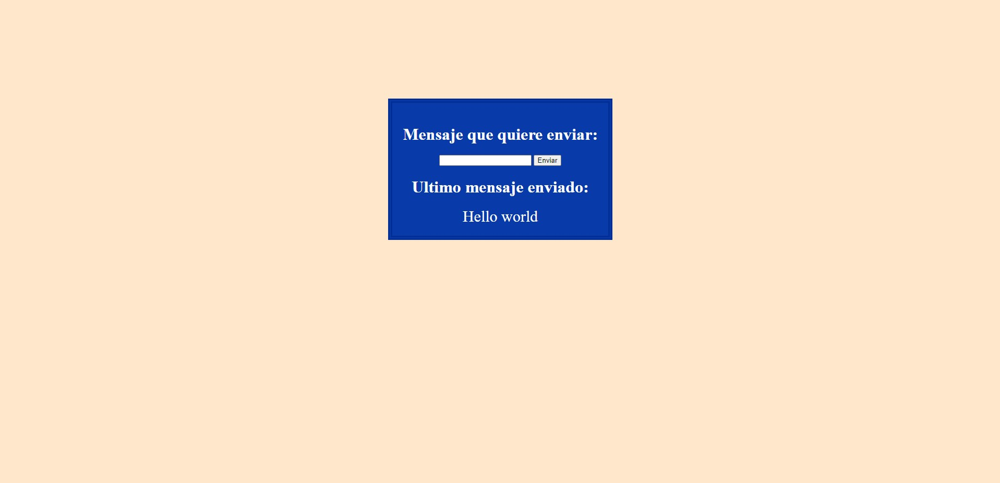

# Send Sentence

*In this project I learned many new things, and noticed more difficulty. I proposed to be able to make an input that can send the written phrase to an intended part of the DOM.*  

### I used

*   DOM Management
*   SetTimeout function
*   Dynamic class change 

